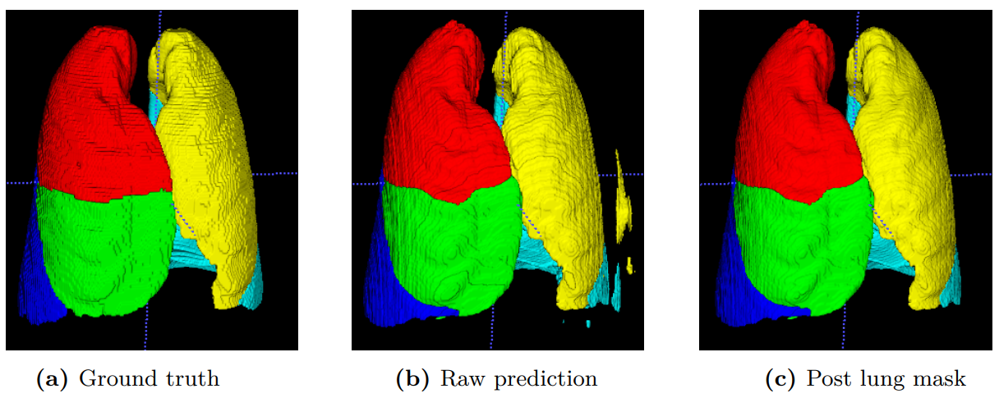

<div align="center">

<h1 align="center">PLS-Net (PyTorch)</h1>
<h3 align="center">Reimplementation of the PLS-Net architecture used for lung lobe segmentation in CT proposed by Lee et al. (2019).</h3>

[](https://github.com/andreped/PLS-Net/actions/workflows/test.yml)
[](https://opensource.org/licenses/MIT)
[](https://doi.org/10.1117/1.JMI.8.2.024002)
</div>

The implementation was made for this study by [Bouget et al. (2021)](https://doi.org/10.1117/1.JMI.8.2.024002). The original implementation can be found [here](https://arxiv.org/abs/1909.07474).

The implementation was tested in Python 3.6 with CUDA 10.0.

## Usage

#### Clone repo and install requirements:
```
git clone git+https://github.com/andreped/PLS-Net
cd "PLS-Net"
pip install -r requirements.txt
```

#### Define network:
```
from PLS_pytorch import PLS
network = PLS()
```

(Alternatively) in PyTorch-Lightning:
```
from PLS_lightning import PLS
network = PLS()
```

Disclaimer: Note that the Lightning implementation contains some hardcoded setup and Dataloaders, and thus only serves as an example. However, PyTorch implementation should work out-of-the-box.

## How to cite
If the source code is used in any scientific publication, please, cite the following papers:
* Lee, Hoileong, T. Matin, F. Gleeson and V. Grau. “Efficient 3D Fully Convolutional Networks for Pulmonary Lobe Segmentation in CT Images.” arXiv abs/1909.07474 (2019): n. pag.
* David Bouget, André Pedersen, Sayied Abdol Mohieb Hosainey, Johanna Vanel, Ole Solheim, Ingerid Reinertsen, "Fast meningioma segmentation in T1-weighted magnetic resonance imaging volumes using a lightweight 3D deep learning architecture," J. Med. Imag. 8(2) 024002 (26 March 2021) https://doi.org/10.1117/1.JMI.8.2.024002
